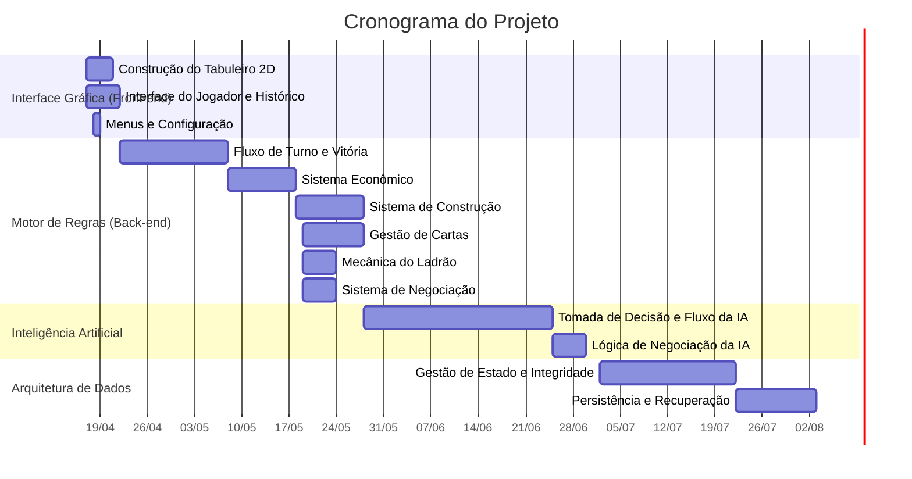

# Cronograma — Gantt

## 1. Marcos (milestones)

| Marco | Data alvo | Entrega associada |
|-------|-----------|-------------------|
| M0 — Kickoff | [PLACEHOLDER] | Escopo inicial, definição de stack |
| M1 — 1ª entrega ES2 | [PLACEHOLDER] | Documentação + produto parcial |
| M2 — MVP jogável | [PLACEHOLDER] | Partida fim a fim com regras “lite” |
| M3 — Encerramento | [PLACEHOLDER] | Relatório final, demo, retrospectiva |

## 2. Gantt (diagrama Mermaid)

Renderiza no GitHub/GitLab em arquivos `.md`. Para **PowerPoint/PDF**, exportem via:

- [Mermaid Live Editor](https://mermaid.live) (copiar o bloco abaixo), ou
- Ferramentas como Project / Excel (importar datas manualmente a partir daqui).

## 3. Dependências críticas

1. Definição de **“Catan Lite”** antes de codificar regras complexas.
2. Contrato API ↔ front antes de integração pesada.
3. Ambiente de demo estável antes da avaliação.

## 4. Buffer

Incluir folga (ex.: 10–15% do cronograma) em tarefas de integração e “polimento” para demo.

---

*Ferramenta de gestão usada: [GitHub Projects / Trello / Jira / outro]: [PLACEHOLDER]*
